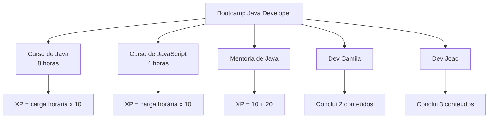

# Desafio DIO: POO em Java

Projeto educacional desenvolvido para praticar os principais conceitos de **Programação Orientada a Objetos (POO)** em Java. A aplicação simula um bootcamp com cursos e mentorias, permitindo inscrever desenvolvedores, acompanhar a progressão dos conteúdos e calcular a experiência acumulada.

<p align="center">
  
  
  
  
</p>

> Um pequeno domínio de aprendizagem para transformar conceitos de POO em um fluxo executável de inscrição, conclusão e pontuação.

## Índice

- [Sobre o projeto](#sobre-o-projeto)
- [Funcionalidades](#funcionalidades)
- [Demonstração](#demonstração)
- [Conceitos praticados](#conceitos-praticados)
- [Requisitos](#requisitos)
- [Instalação e uso](#instalação-e-uso)
- [Tecnologias utilizadas](#tecnologias-utilizadas)
- [Estrutura do projeto](#estrutura-do-projeto)
- [Contribuição](#contribuição)
- [Autor e licença](#autor-e-licença)

## Sobre o projeto

O programa cria um bootcamp chamado **Bootcamp Java Developer**, adiciona dois cursos e uma mentoria e, depois, inscreve duas pessoas desenvolvedoras nesse bootcamp:

- **Camila** conclui dois conteúdos.
- **João** conclui três conteúdos.
- Cada curso gera XP proporcional à sua carga horária.
- Cada mentoria possui uma pontuação fixa adicional.

A classe `Conteudo` define a abstração comum. `Curso` e `Mentoria` especializam o cálculo de XP, enquanto `Dev` controla inscrições, progresso, conteúdos concluídos e XP total.

## Funcionalidades

- Criar e configurar um bootcamp.
- Adicionar cursos e mentorias ao bootcamp.
- Registrar desenvolvedores no bootcamp.
- Listar conteúdos inscritos e concluídos.
- Avançar para o próximo conteúdo disponível.
- Calcular o XP total de cada desenvolvedor.
- Representar cursos e mentorias com comportamentos específicos.
- Manter a ordem dos conteúdos com `LinkedHashSet`.
- Evitar conteúdos duplicados por meio de conjuntos.

## Demonstração

Execute o programa para acompanhar a evolução dos desenvolvedores no console:

```text
Conteúdos Inscritos Camila:[Curso{titulo='curso java', descricao='descrição curso java', cargaHoraria=8}, ...]
-
Conteúdos Inscritos Camila:[...]
Conteúdos Concluídos Camila:[...]
XP:...
-------
Conteúdos Inscritos João:[...]
-
Conteúdos Inscritos João:[...]
Conteúdos Concluidos João:[...]
XP:...
```

### Fluxo do domínio



Não há capturas de tela versionadas neste repositório. A demonstração atual é executada diretamente no terminal, e o diagrama acima representa visualmente o fluxo principal da aplicação.

## Conceitos praticados

- Classes e objetos
- Encapsulamento com atributos privados
- Herança por meio de `extends`
- Polimorfismo com `calcularXp()`
- Classe abstrata `Conteudo`
- Sobrescrita de métodos com `@Override`
- Interfaces implícitas de comportamento entre classes
- Coleções `Set` e implementação `LinkedHashSet`
- `Optional` para verificar conteúdos disponíveis
- Streams e `mapToDouble`
- `LocalDate` para registrar a data da mentoria
- `equals()` e `hashCode()` para comparação de objetos

## Requisitos

- JDK 11 ou superior
- Terminal ou editor de código, como o VS Code ou IntelliJ IDEA
- Git, caso o projeto seja obtido por clone

O código utiliza `var`, `Optional`, streams e a API `java.time`. O JDK 11 ou uma versão mais recente é recomendado.

## Instalação e uso

Clone o repositório e entre na pasta do projeto:

```bash
git clone <URL_DO_REPOSITORIO>
cd desafio-dio-POO
```

Como o projeto não possui Maven ou Gradle, compile os arquivos diretamente com `javac`:

```bash
rm -rf out
mkdir -p out
javac -d out src/Main.java src/br/com/dio/desafio/dominio/*.java
```

Execute a classe principal:

```bash
java -cp out Main
```

No Windows PowerShell, o comando de compilação pode ser executado assim:

```powershell
New-Item -ItemType Directory -Force out
javac -d out src/Main.java src/br/com/dio/desafio/dominio/*.java
java -cp out Main
```

## Tecnologias utilizadas

- **Java**: linguagem de programação principal.
- **JDK**: compilação e execução do projeto.
- **Java Collections Framework**: uso de `Set` e `LinkedHashSet`.
- **Java Streams**: cálculo do XP acumulado.
- **Java Time API**: registro da data da mentoria.
- **IntelliJ IDEA**: metadados de desenvolvimento presentes no projeto.

## Estrutura do projeto

```text
src/
├── Main.java
└── br/com/dio/desafio/dominio/
    ├── Bootcamp.java
    ├── Conteudo.java
    ├── Curso.java
    ├── Dev.java
    └── Mentoria.java
```

### Responsabilidade das classes

| Classe     | Responsabilidade                                                |
| ---------- | --------------------------------------------------------------- |
| `Bootcamp` | Mantém dados, conteúdos e desenvolvedores inscritos.            |
| `Conteudo` | Define a abstração e o contrato de cálculo de XP.               |
| `Curso`    | Representa um curso e calcula XP pela carga horária.            |
| `Mentoria` | Representa uma mentoria e calcula seu XP fixo.                  |
| `Dev`      | Controla inscrição, progresso, conclusão e XP do desenvolvedor. |
| `Main`     | Monta o cenário de demonstração e exibe os resultados.          |

## Contribuição

1. Faça um fork do projeto.
2. Crie uma branch para sua alteração:

   ```bash
   git checkout -b feature/minha-melhoria
   ```

3. Implemente a mudança mantendo a separação de responsabilidades.
4. Compile e execute o projeto para verificar o comportamento.
5. Envie um Pull Request com uma descrição objetiva.

Sugestões de evolução incluem adicionar novos tipos de conteúdo, validar datas do bootcamp, criar testes automatizados e separar a montagem do cenário de demonstração da classe `Main`.

## Autor e licença

**Autor:** Valdir Luz  
**GitHub:** [valdirluz-dev](https://github.com/valdirluz-dev)

O repositório não possui atualmente um arquivo `LICENSE`. Portanto, o código deve ser considerado **sem licença explícita** até que o autor adicione uma licença formal, como MIT ou Apache 2.0.

---

Projeto criado para praticar POO e evoluir fundamentos de Java por meio de um domínio simples e executável.
